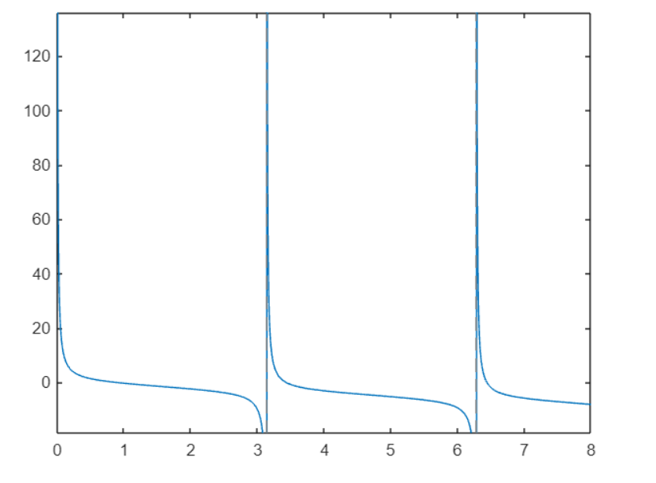

# 📘 Mathematical Software I – MATLAB Practice Report

This repository contains a collection of exercises completed for the **Mathematical Software I** course.  
The tasks focus on applying MATLAB (with Symbolic Math Toolbox) to solve mathematical problems, visualize functions, and explore symbolic computation.

---

## 📑 Contents
The exercises included in this repository cover the following topics:

1. **Inequality solving** – Symbolic approach to finding the solution set.  
2. **System of linear equations** – Solving simultaneous equations using symbolic methods.  
3. **Function visualization** – Plotting trigonometric functions within a given interval.  
4. **Piecewise functions and limits** – Defining piecewise functions and computing limits.  
5. **Trigonometric transformations** – Plotting `cot(x) - x` over a defined range.  

  

6. **Root finding** – Using numerical methods (`fzero`) to approximate roots of nonlinear functions.  
7. **Derivatives and polynomials** – Differentiation, polynomial manipulation, and root calculation.  
8. **Angle conversion** – Converting degrees to radians programmatically.

---

## 🔧 Requirements
- **MATLAB** (latest version recommended)  
- **Symbolic Math Toolbox**  

---

## 🚀 How to Use
1. Clone the repository.
2. Open MATLAB.
3. Run the provided script file to test each exercise.

## 🎯 Purpose

These exercises were prepared as part of the **Mathematical Software I** course to practice:

- Symbolic computation  
- Visualization of mathematical functions  
- Numerical and algebraic problem-solving in MATLAB  
